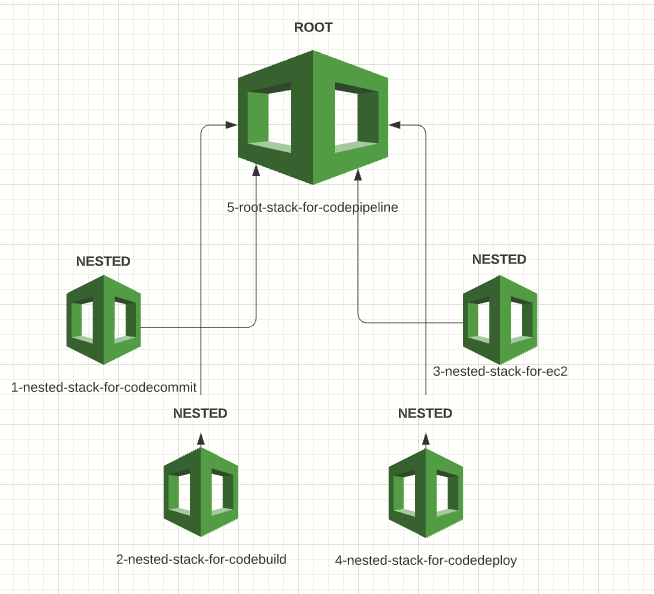

# AWS CI/CD Pipeline
This is a demo project that helps to build a simple CI/CD pipeline on AWS using IaC approach. For the purposes of this demo, I've created a simple .NET Core web application and host it using AWS CodeCommit repository, AWS CodeBuild CI service, and AWS CodeDeploy to deploy the application on the Amazon EC2 instance. AWS CodePipeline was used to build and deploy the code every time there is a code.

As I’m strongly against managing environments manually and take Infrastructure as Code for granted, AWS CloudFormation was used to automate the process. As a result, the entire CI/CD pipeline set can be deployed on any AWS account using CloudFormation templates only.

## **Architecture**

The high-level architecture for our project is illustrated in the diagram below:

:point_right: **AWS CodeCommit** as a source control service that hosts Git-based repositories. We are going to commit and push our web application into the source branch of the AWS CodeCommit repository. Each push will trigger the CI/CD pipeline once we set the process.

:point_right: **AWS CodeBuild** as a continuous integration service that compiles source code, runs tests, and produces software packages that are ready to deploy. AWS CodeBuild creates a Linux container, downloads the file that contains the source code from AWS CodeCommit repository, unpacks it, and runs tests (if any). Then it drops the build artifacts into S3 bucket.

:point_right: **AWS CodeDeploy** as a deployment service that automates code deployments to any instance, including Amazon EC2 instances, AWS Fargate, AWS Lambda, and instances running on-premises. In our case, AWS CodeDeploy gets the build artifacts from S3 bucket and deploys them on EC2 instance.

:point_right: **AWS CodePipeline** as a continuous delivery service. This is the thing that brings all three services listed above together into our CI/CD pipeline.

## **CloudFormation structure**

Instead of manually managing and configuring all of the AWS services that are needed for an application to run, build and deploy (with a click here, a click there), we are going to automate the process by using **Infrastructure as Code (IaC)**. It saves us a ton of time and money and of course, gives a great flexibility to quickly set up our complete infrastructure by running a script for every environment (from development to production):blue_heart:.

**AWS CloudFormation** is be a great fit for this project as it is naturally integrated with CodePipeline and other AWS builder tools.

To keep in simple, I've created five separate templates :
:one: for CodeCommit named `1-nested-stack-for-codecommit`
:two: for CodeBuild named `2-nested-stack-for-codebuild`
:three: for two EC2 instances (DEV and PROD) named `3-nested-stack-for-ec2`
:four: for CodeDeploy named `4-nested-stack-for-codedeploy`
:five: for CodePipeline named `5-root-stack-for-codepipeline` 

The stack for CodePipeline template is a **root** stack. The stacks for the rest four templates are **nested** stacks. In other words, CodePipeline stack is the root stack for all the other, nested, stacks in the hierarchy (CodeCommit, CodeBuild, EC2 instances and CodeDeploy). Here is a the diagram of root-nested stacks:

# Step 1
First, you need to create a new "cicd-bucket-for-nested-stacks" S3 bucket, drop a;; yaml templates there and make them public.

# Step 2
Go to CloudFormation and run "" template

kali: Samira, add nested stacks diagram 

# Step 3
Create and push a new code
