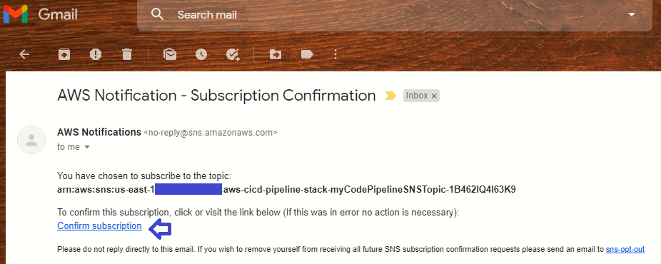
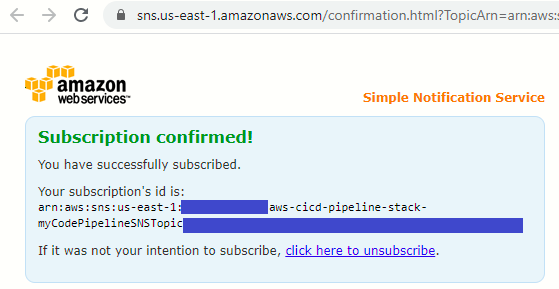
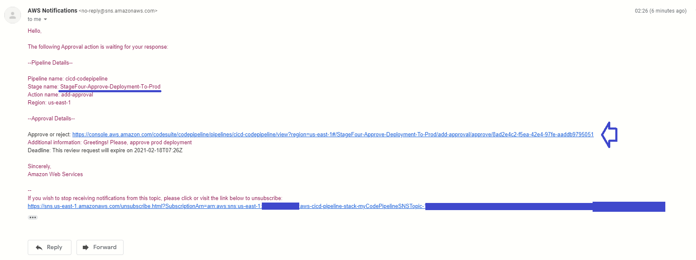

# AWS CI/CD Pipeline
This is a demo project that helps to build a simple CI/CD pipeline on AWS using IaC approach. For the purposes of this demo, I've created a simple .NET Core web application and host it using AWS CodeCommit repository, AWS CodeBuild CI service, and AWS CodeDeploy to deploy the application on the Amazon EC2 instance. AWS CodePipeline was used to build and deploy the code:
- to **DEV** environment every time there is a code change 
- to **PROD** environment every time there is a code change which is approved by an authorized user (this user should get an email notification)

As I’m strongly against managing environments manually and take Infrastructure as Code for granted, AWS CloudFormation was used to automate the process. As a result, the entire CI/CD pipeline set can be deployed on any AWS account using CloudFormation templates only.

## **Architecture**

The high-level architecture for our project is illustrated in the diagram below:

:point_right: **AWS CodeCommit** as a source control service that hosts Git-based repositories. Each commit and push of the code into the source branch of the AWS CodeCommit repository will trigger the CI/CD pipeline once the process is set.

:point_right: **AWS CodeBuild** as a continuous integration service that compiles source code, runs tests, and produces software packages that are ready to deploy. AWS CodeBuild creates a Linux container, downloads the file that contains the source code from AWS CodeCommit repository, unpacks it, and runs tests (if any). Then it drops the build artifacts into S3 bucket.

:point_right: **AWS CodeDeploy** as a deployment service that automates code deployments to any instance, including Amazon EC2 instances, AWS Fargate, AWS Lambda, and instances running on-premises. In our case, AWS CodeDeploy gets the build artifacts from S3 bucket and deploys them on EC2 instance.

:point_right: **AWS CodePipeline** as a continuous delivery service. This is the thing that brings all three services listed above together into our CI/CD pipeline.

## **CloudFormation structure**

Instead of manually managing and configuring all of the AWS services that are needed for an application to run, build and deploy (with a click here, a click there), I've automated the process by using **Infrastructure as Code (IaC)**. It saves a ton of time and money and of course, gives a great flexibility to quickly set up the complete infrastructure by running a script for every environment :blue_heart:.

**AWS CloudFormation** is be a great fit for this project as it is naturally integrated with CodePipeline and other AWS builder tools.

To keep it simple, I've separated out some resources and created five dedicated AWS CloudFormation templates for them:

:one: for CodeCommit named `1-nested-stack-for-codecommit`

:two: for CodeBuild named `2-nested-stack-for-codebuild`

:three: for two EC2 instances (DEV and PROD) named `3-nested-stack-for-ec2`

:four: for CodeDeploy named `4-nested-stack-for-codedeploy`

:five: for CodePipeline named `5-root-stack-for-codepipeline` 

The stack for CodePipeline template is a **root** stack. The stacks for the rest four templates are **nested** stacks. In other words, CodePipeline stack is the root stack for all the other, nested, stacks in the hierarchy: CodeCommit, CodeBuild, EC2 instances and CodeDeploy. 

Here is a the diagram of root-nested stacks:

## **How to get started**

#### :point_right: **Step 1**
First, you need to create a new `cicd-bucket-for-nested-stacks` S3 bucket, upload all nested yaml templates there and make them public.

#### :point_right: **Step 2**
Go to CloudFormation console and create a root stack using "5-root-stack-for-codepipeline" template. All the other, nested, stacks will be created automatically.

Specify your email for PROD deployment approval in `Parameters` section.

Note, you need to create EC2 key pair prior to stack creation.

#### :point_right: **Step 3**
Check your email and confirm the subscription to SNS topic for CodePipeline notifications.

#### :point_right: **Step 4**
Go to a newly created CodePipeline console. You should see the very first step is failed. It's because our CodeCommit repository doesn't have any source code yet. 

Follow the steps in [source-code-dotnet-web-app\README](source-code-dotnet-web-app\README.md) file to push the code to a new repository. You can find the HTTP and SSH urls of AWS CodeCommit repository among CloudFormation root stack outputs - go to CloudFormation console, find the root stack, navigate to Outputs tab of the menu and copy the URL:

#### :point_right: **Step 5**
Once you push the code to AWS CodeCommit repository, go back to CodePipeline console. Sit Back, Relax, and Enjoy CI/CD proccess! 

Your code should be build and pushed to EC2 instance for DEV env. Go to CloudFormation console, find the root stack, navigate to Outputs tab of the menu and get `Dev application access URL`. Open the URL in the browser! 

#### :point_right: **Step 6**
For PROD changes you need to approve the deployment. 

Check your email:

Approve the deployment to PROD env:

Open the PROD URL in the browser! 

#### :point_right: **Step 7**

You can make some changes in the code, then push it to AWS CodeCommit repo and enjoy the automated CI/CD proccess as much as you want! Isn't it magic? :blue_heart:

## **Cleanup**

To clean up the code, 

First thing first, you need to emptify `cicd-bucket-for-nested-stacks` S3 bucket

Then....

## **Happy dance**

Finally, don't forget to do your happy dance!

